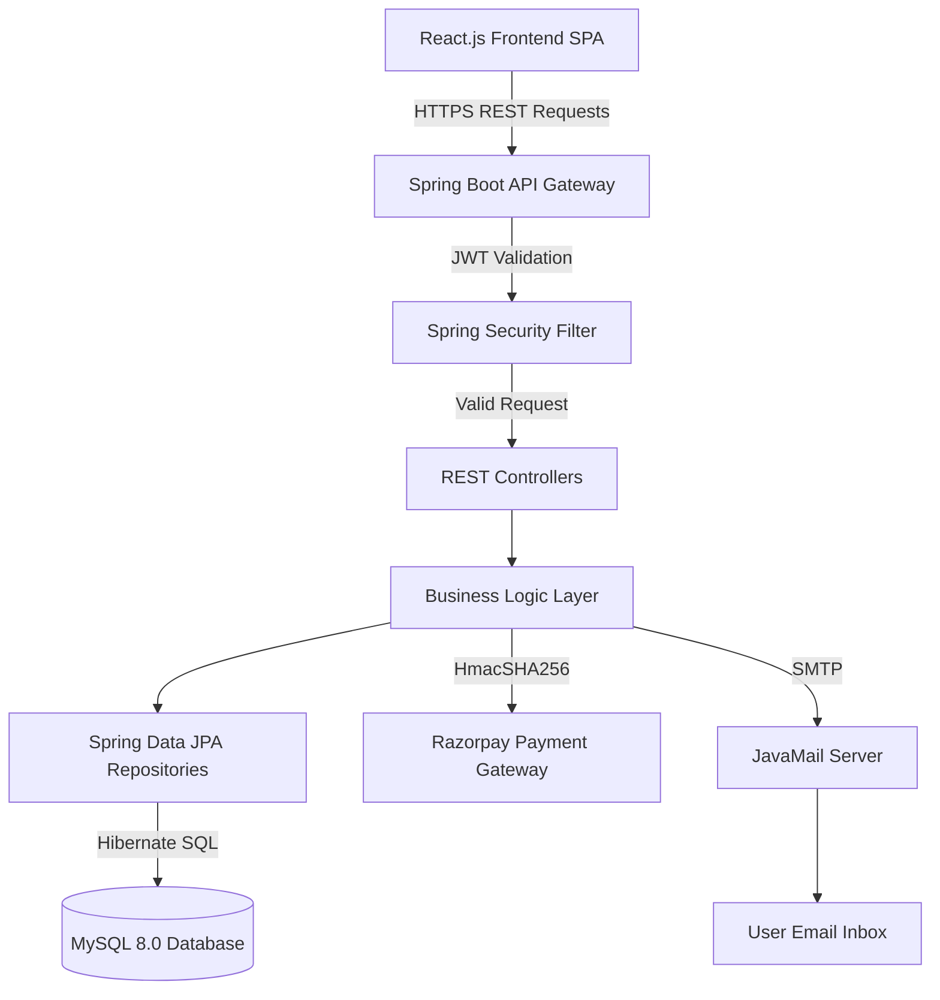

# ⚡ EventSphere — The Complete Enterprise Guide & Software Requirements Specification (SRS)

> **Version:** 3.5 (Enterprise Edition) | **Last Updated:** May 2026
> **Project Path:** `C:\Users\sanna\Downloads\E3\EventBookingProject\`
> **Institution:** Vel Tech Rangarajan Dr. Sagunthala R&D Institute of Science and Technology

---

## 📖 MASTER TABLE OF CONTENTS
1. [Executive Summary & Introduction](#1-executive-summary--introduction)
2. [High-Level System Architecture](#2-high-level-system-architecture)
3. [The User Manual: Getting Started](#3-the-user-manual-getting-started)
4. [The User Manual: Student Experience](#4-the-user-manual-student-experience)
5. [The User Manual: Faculty Experience](#5-the-user-manual-faculty-experience)
6. [The User Manual: Admin Command Center](#6-the-user-manual-admin-command-center)
7. [The User Manual: On-Site Execution](#7-the-user-manual-on-site-execution)
8. [Comprehensive UI/UX Specifications](#8-comprehensive-uiux-specifications)
9. [Complete Database Schema (Entities)](#9-complete-database-schema-entities)
10. [REST API Endpoint Matrix](#10-rest-api-endpoint-matrix)
11. [Security & Cryptographic Standards](#11-security--cryptographic-standards)
12. [Quality Assurance & Test Cases](#12-quality-assurance--test-cases)
13. [Deployment, Configuration & Troubleshooting](#13-deployment-configuration--troubleshooting)
14. [Future Enhancements Roadmap](#14-future-enhancements-roadmap)

---

## 1. EXECUTIVE SUMMARY & INTRODUCTION

### 1.1 Purpose of the Document
This massive document provides an exhaustive architectural, functional, and operational breakdown of **EventSphere**, an enterprise-grade Smart Event Booking & Management System. This document serves as the ultimate source of truth for developers, system administrators, and university stakeholders. It combines a highly technical Software Requirements Specification (SRS) with a deeply practical User Manual.

### 1.2 Scope of the Application
EventSphere is designed to handle thousands of concurrent users during peak university event seasons (e.g., tech fests, cultural symposiums, hackathons). It completely digitizes the event lifecycle:
- **Pre-Event Phase:** Event creation, automated approval chains, dynamic pricing, and targeted publishing.
- **Registration Phase:** Secure individual/team checkout flows, Razorpay integration, external college validation, and dynamic team sizing.
- **Execution Phase:** On-premise execution tools including ultra-fast JSON-based QR scanning, live attendance tracking, and granular attendee profile editing.
- **Post-Event Phase:** Financial ledger generation, automated HTML E-Certificate dispatches with embedded institutional branding, and comprehensive PDF post-reports.

### 1.3 Target Audience & Personas
1. **Students (Internal VelTech):** Authenticate using university email domains. Require VTU/VTP numbers. Enjoy frictionless 1-click free registrations.
2. **Students (External Entities):** Authenticate using non-university domains. System dynamically requires robust external identification (College Name, City, State) and offers accommodation options.
3. **Faculty Coordinators:** Operate as mid-level administrators. Can request event creation, manage their specific event's ledger, scan attendees, and dispatch certificates.
4. **Super Administrators:** Possess ultimate platform oversight. Can override event states, ban users, verify faculty credentials, and view university-wide financial influx.

---

## 2. HIGH-LEVEL SYSTEM ARCHITECTURE

EventSphere is engineered on a modern **Decoupled Client-Server Architecture** utilizing stateless RESTful API communications to guarantee infinite horizontal scalability.

### 2.1 The Client Layer (Frontend)
- **Framework:** React.js 18 (Single Page Application architecture).
- **Bundler:** Vite 5 (Ensuring sub-second HMR and aggressive production minification).
- **Routing:** React Router DOM 6 (Client-side routing with `ProtectedRoute` guards intercepting unauthenticated access).
- **State Management:** React Context API (`AuthContext` for global session hydration) and localized component states.
- **Styling:** Custom Vanilla CSS Design System enforcing modern Glassmorphism, tailored Dark Modes, and CSS Custom Properties (Variables) for seamless theming.
- **Network Layer:** Axios client configured with localized interceptors to auto-inject Bearer JWTs into request headers and handle 401 Unauthorized token expirations.
- **Client-side Render Engines:** `jsPDF` and `html2canvas` for instantaneous browser-side PDF generation (Tickets and Post-reports), reducing server load.

### 2.2 The Server Layer (Backend)
- **Core Framework:** Spring Boot 3.3.5 running an Embedded Apache Tomcat server.
- **Security Perimeter:** Spring Security 6 implementing a custom `JwtAuthFilter` within the `SecurityFilterChain`.
- **Data Abstraction:** Spring Data JPA over Hibernate 6.5.3, providing an Object-Relational Mapping (ORM) layer to eliminate raw SQL vulnerabilities.
- **Relational Persistence:** MySQL 8.0 ensuring ACID compliance across concurrent financial transactions.
- **Authentication Protocol:** `io.jsonwebtoken` implementation for stateless, tamper-proof JSON Web Tokens.
- **Communication Gateway:** JavaMailSender utilizing Gmail SMTP for reliable asynchronous delivery of OTPs, booking confirmations, and MIME multipart E-Certificates.
- **Financial Gateway:** Official Razorpay Java SDK for executing server-side signature validations via HmacSHA256.
- **Data Serialization:** FasterXML Jackson 2 for dynamic JSON payload parsing (crucial for the new QR Scanner architecture).

### 2.3 Architectural Diagram (Conceptual)


---

## 3. THE USER MANUAL: GETTING STARTED

### 3.1 The Registration Page (`/register`)
The registration process intelligently adapts based on who you are.
- **For Vel Tech Students:** Enter an `@veltech.edu.in` email. The system will detect your domain and ask for your unique **VTU/VTP/VTA Number**.
- **For External Students:** Enter a Gmail/Yahoo address. The system will dynamically switch to ask for your **College Name, State, and City**.
- **For Faculty:** Select the "Faculty" role. You will be asked for your **TTS Number**. *Note: Faculty accounts cannot log in immediately. They are placed in a `PENDING_APPROVAL` queue until a System Administrator verifies their identity.*

### 3.2 The Login Page (`/login`)
EventSphere offers **Dual Authentication**:
- **Traditional Login:** Use your registered Email and Password.
- **Passwordless OTP Login:** Forgot your password? Switch to the OTP tab, enter your email, and the system will email you a secure 6-digit code. Enter the code to instantly log in without ever needing to reset your password.

---

## 4. THE USER MANUAL: STUDENT EXPERIENCE

### 4.1 The Events Home Page (`/`)
This is the landing hub where all **PUBLISHED** events are displayed.
- **Dynamic Filtering:** Click on department chips (CSE, IT, MECH, etc.) to instantly filter the visible events. Use the search bar to find specific titles.
- **Event Cards:** Each card displays vital information: Pricing, Dates, Venue, and whether it is a **Team Event** (e.g., "Limit: 50 teams | Max 4 per team").
- **Live Countdowns:** If an event is running out of capacity, the card flashes "Low Ticket" warnings. If capacity hits 0, it is stamped with a slanted red "SOLD OUT" badge and cannot be clicked.

### 4.2 The EventSphere AI Chatbot
Located at the bottom right of the screen is a floating chat bubble.
- Click it to awaken the **EventSphere AI**.
- Type natural phrases like *"Are there any hackathons?"* or *"Show me CSE events"*.
- The AI will query the database and respond with **clickable links**. Clicking the link inside the chat window instantly routes you to the booking page for that event.

### 4.3 The Booking Process (`/book/:eventId` & `/book-multi/:eventId`)
- **Single Events:** For solo events, the form auto-fills your database profile (Name, Email). Just click confirm.
- **Team Events:** For team events, you are assigned as the "Team Leader". You must enter a **Team Name**. The system provides an "Add Member" button. This button will automatically disappear once you hit the event's `max_team_size`.
- **Accommodation:** For external students booking multi-day events, a checkbox appears allowing you to request hostel accommodation.

### 4.4 The Payment Gateway (`/payment`)
If the event costs money, you will be routed to a secure Checkout Screen.
- Clicking "Pay Now" opens the official **Razorpay Modal**.
- You can pay via UPI, Credit/Debit Card, or Netbanking.
- Once Razorpay confirms receipt of funds, the backend securely validates the signature and confirms your booking.

### 4.5 Personal Profile & Digital Tickets (`/profile`)
- **Active Registrations:** Your dashboard shows all your upcoming events.
- **Digital QR Tickets:** Attached to your booking is a unique **QR Code**. This is your entry pass. You must present this to the faculty on the day of the event.
- **Withdrawal System:** If you can no longer attend, you can click "Withdraw". A strict confirmation modal appears outlining the consequences. Withdrawing instantly releases your ticket back to the public pool.

---

## 5. THE USER MANUAL: FACULTY EXPERIENCE

### 5.1 Creating an Event
Once approved by an Admin, Faculty members can access the Admin Dashboard.
- **Event Creation Form:** Faculty can define Event Name, Dates, Venue, Description, and upload a Poster Image.
- **Team Settings:** Faculty can toggle `isTeamEvent`. If true, they must define `max_team_size` (e.g., 4 members) and `max_teams` (e.g., 50 teams total).
- **Targeting:** Faculty can restrict the event so that only 3rd-year students or only ECE students can see it.

### 5.2 The Lifecycle Toggles
Newly created events start as **DRAFTS** and must be approved by an Admin. Once approved, Faculty control the flow:
1. **Publish Event:** Makes the event visible on the Home Page, but students cannot book yet.
2. **Open Registration:** Activates the "Book Ticket" buttons.
3. **Pause Registration:** Temporarily blocks new bookings (useful if servers are overloaded or adjustments are needed).
4. **Complete Event:** Permanently locks the event and prepares it for Post-Report generation.

---

## 6. THE USER MANUAL: ADMIN COMMAND CENTER
Located at `/admin`, this is the heart of EventSphere for Super Administrators. It features 5 distinct tabs:

### 6.1 Overview Tab
- **Visual Analytics:** Displays beautiful, interactive charts (Bar graphs for revenue, Doughnut charts for department participation).
- **Global Metrics:** Shows total revenue generated, total users registered, and total tickets sold across the entire university platform.

### 6.2 Events Tab
- A master list of every event in the system. Admins can bypass faculty restrictions to forcefully **Edit, Publish, Cancel, or Delete** any event.
- **Campaign Emails:** Admins can select an event and type a custom message to blast an email to *every single user* who registered for that specific event.

### 6.3 Bookings Tab
- A massive global ledger of every financial transaction and booking reference (e.g., `BK-A1B2C3`). Highly useful for auditing Razorpay discrepancies.

### 6.4 Faculty Queue Tab
- When a new professor registers, they appear here. Admins must verify their identity and click **Approve** to grant them dashboard access.

### 6.5 Users Tab
- A global directory of all students and faculty.
- **Deactivation (Ban Hammer):** If a student is misbehaving, an Admin can toggle their status to "Inactive". The moment this happens, the student is globally logged out and blocked from ever logging in again.

---

## 7. THE USER MANUAL: ON-SITE EXECUTION

This module is accessed via `/admin/events/:eventId/registrations` and is used on the actual day of the event.

### 7.1 The QR Scanner (`/admin/scanner`)
- Faculty can open this page on a smartphone or laptop with a webcam.
- It activates the camera to scan the Student's **Digital QR Ticket**.
- The scanner reads the highly-secure JSON payload inside the QR code.
- **Green Flash:** "Check-in Successful!" The student is marked present.
- **Yellow Flash:** "Already Checked In." Warns the faculty that the student is trying to use the ticket twice.
- **Red Flash:** "Invalid Ticket." The QR code does not belong to this event.

### 7.2 Granular Attendee Management
- On the registrations list, you will see every team and their members.
- **Edit Details (Gear Icon):** If a student misspelled their name or email during registration, an Admin can click the Gear Icon next to their specific name. This opens a modal to surgical edit just that individual's details without destroying the parent booking or affecting the Razorpay payment.

### 7.3 Automated E-Certificates
- Once the event is over, Faculty can click **"Enable Certificates"**.
- Click **"Generate & Send All"**.
- The system will iterate through *only* the students who were marked as "Checked In" by the QR scanner.
- It dynamically generates an HTML Certificate featuring the student's name, the event name, and the embedded **Vel Tech Logo**.
- The certificate is automatically emailed to the student.

### 7.4 The Expense Ledger
- Organizing an event costs money. The dashboard includes an Expense Tracker.
- Faculty can log individual costs: Category (Food, Venue, Prizes), Amount, and upload a photographic receipt.
- This creates total financial transparency for the university.

### 7.5 The Event Post-Report
- Click the **"Print/Save PDF"** button.
- The system generates an exhaustive, multi-page administrative report.
- It details: Total Revenue Inflow, Total Expense Outflow, Net Profit/Loss, complete demographic breakdown of attendees by department, and a list of all checked-in participants.

---

## 8. COMPREHENSIVE UI/UX SPECIFICATIONS

The frontend contains over 12 distinct routes providing a rich SPA experience.

### 8.1 Public Interfaces
- **`/` (Events Home):** Dynamic showcase of all published events. Features real-time filtering by department, live ticket countdowns, and embedded EventSphere AI Chatbot for intuitive querying.
- **`/login`:** Secure entry point. Offers a dual-tab layout allowing standard "Email & Password" login or "Passwordless OTP" login. Handles account status errors (e.g., pending faculty approvals or banned users).
- **`/register`:** Intelligent registration form. Uses reactive validation to instantly adapt required fields (like TTS/VTU numbers or External College identifiers) based on the user's role and email domain.

### 8.2 Student / Protected Interfaces
- **`/profile`:** Personal dashboard displaying active bookings, past attendance history, and the user's digital ID. Includes a dynamic, state-aware "Withdraw" feature for unstarted events.
- **`/book/:eventId` (Individual Booking):** Clean, distraction-free checkout page for solo event registrations. Summarizes event pricing and automatically injects the logged-in user's details.
- **`/book-multi/:eventId` (Team Booking):** Complex dynamic form mapping to the event's `max_team_size`. Validates individual attendee inputs ensuring no missing data before submission.
- **`/payment`:** A secure transition gateway that natively initializes the Razorpay Javascript modal. Displays transaction status and redirects upon successful backend signature validation.
- **`/notifications`:** Real-time bell dropdown and dedicated page categorizing alerts (System, Event Updates, Payments) with "Mark all as Read" bulk actions.

### 8.3 Faculty / Admin Management Interfaces
- **`/admin` (Admin Dashboard Master):** The command center featuring 5 core tabbed views (Overview, Events, Bookings, Faculty Queue, Users).
- **`/admin/events/:eventId/registrations` (Event Operations):** A drill-down view for a specific event displaying every registered team and their individual members. Includes robust tools like Granular Editing, Certificate Engine, Expense Ledger, and Post-Report Export.
- **`/admin/scanner` (QR Code Engine):** Transforms the device camera into an ultra-fast check-in module. Instantly parses JSON payloads off digital tickets and communicates with the backend to flag attendees as physically present.

---

## 9. COMPLETE DATABASE SCHEMA (ENTITIES)

The MySQL schema is heavily normalized to 3NF to prevent data anomalies.

### 9.1 The `users` Table
| Column Name | Data Type | Constraints | Description |
|---|---|---|---|
| `id` | BIGINT | PRIMARY KEY, AUTO_INC | Unique identifier |
| `name` | VARCHAR(255) | NOT NULL | User's full legal name |
| `email` | VARCHAR(255) | UNIQUE, NOT NULL | Must be a valid email format |
| `password` | VARCHAR(255) | | BCrypt hashed string. Null if purely OTP user |
| `role` | VARCHAR(50) | NOT NULL | Enum: STUDENT, FACULTY, ADMIN |
| `department` | VARCHAR(100) | | CSE, IT, MECH, etc. |
| `year_of_study` | INT | | 1, 2, 3, 4 |
| `vtu_number` | VARCHAR(50) | | Internal VelTech Student ID |
| `tts_number` | VARCHAR(50) | | Internal Faculty ID |
| `approved` | BOOLEAN | DEFAULT FALSE | TRUE for all except new Faculty |

### 9.2 The `events` Table
| Column Name | Data Type | Constraints | Description |
|---|---|---|---|
| `id` | BIGINT | PRIMARY KEY, AUTO_INC | Unique identifier |
| `event_name` | VARCHAR(255) | NOT NULL | Title of the event |
| `image_url` | LONGTEXT | | Base64 encoded poster image |
| `price` | DECIMAL(10,2) | NOT NULL | Entry cost. 0.00 for free events |
| `total_tickets` | INT | NOT NULL | Hard capacity limit |
| `available_tickets`| INT | NOT NULL | Dynamic countdown counter |
| `status` | VARCHAR(50) | NOT NULL | DRAFT, PUBLISHED, COMPLETED, etc. |
| `is_team_event` | BOOLEAN | DEFAULT FALSE | Changes booking logic entirely |
| `max_team_size` | INT | | Restricts UI dynamic fields |
| `max_teams` | INT | | Cap on total team registrations |

### 9.3 The `bookings` Table
| Column Name | Data Type | Constraints | Description |
|---|---|---|---|
| `id` | BIGINT | PRIMARY KEY, AUTO_INC | Unique identifier |
| `user_id` | BIGINT | FOREIGN KEY | References the Team Leader / Buyer |
| `event_id` | BIGINT | FOREIGN KEY | References the Event |
| `booking_reference`| VARCHAR(100) | UNIQUE | Human-readable ID (e.g., BK-A1B2C3) |
| `status` | VARCHAR(50) | NOT NULL | PENDING_PAYMENT, CONFIRMED, CANCELLED |
| `total_amount` | DECIMAL(10,2) | NOT NULL | Final cost processed by Razorpay |
| `razorpay_payment_id`| VARCHAR(255)| | Official gateway receipt ID |
| `team_name` | VARCHAR(255) | | Provided if `is_team_event` is TRUE |

### 9.4 The `attendees` Table
| Column Name | Data Type | Constraints | Description |
|---|---|---|---|
| `id` | BIGINT | PRIMARY KEY, AUTO_INC | Unique identifier |
| `booking_id` | BIGINT | FOREIGN KEY | The parent financial transaction |
| `name` | VARCHAR(255) | NOT NULL | Individual's name |
| `email` | VARCHAR(255) | NOT NULL | Individual's email (for certificates) |
| `qr_token` | VARCHAR(255) | UNIQUE | The exact string scanned at entry (ATT-UUID) |
| `attendance_status`| VARCHAR(50) | NOT NULL | PENDING, CHECKED_IN, CHECKED_OUT |
| `check_in_time` | DATETIME | | Exact millisecond timestamp of physical entry |

### 9.5 The `event_expenses` Table
| Column Name | Data Type | Constraints | Description |
|---|---|---|---|
| `id` | BIGINT | PRIMARY KEY, AUTO_INC | Unique identifier |
| `event_id` | BIGINT | FOREIGN KEY | Links the cost to an event ledger |
| `category` | VARCHAR(100) | NOT NULL | Venue, Food, Logistics, Prizes, etc. |
| `amount` | DECIMAL(10,2) | NOT NULL | Financial hit |
| `receipt_base64` | LONGTEXT | | Photographic proof of purchase |

---

## 10. REST API ENDPOINT MATRIX

| Domain | Method | Endpoint Path | Critical Body Payload | Description |
|---|---|---|---|---|
| **Auth** | POST | `/api/auth/register` | `{name, email, password, role}` | Creates user. Enforces domain checks. |
| **Auth** | POST | `/api/auth/login` | `{email, password}` | Returns JWT String. |
| **Auth** | POST | `/api/auth/login-otp` | `{email}` | Dispatches 6-digit code via SMTP. |
| **Events** | POST | `/api/events` | `{eventName, price, totalTickets}` | Creates DRAFT event. |
| **Events** | GET | `/api/events` | `?search=...&department=...` | Dynamic search used by Chatbot & UI. |
| **Events** | POST | `/api/events/{id}/publish` | `None` | Transitions state. Begins countdowns. |
| **Bookings**| POST | `/api/bookings` | `{eventId, tickets, attendees[]}` | Core transaction logic. Initiates Razorpay. |
| **Bookings**| POST | `/api/bookings/{id}/cancel`| `None` | Releases tickets back to pool. Alters state. |
| **Attendees**| PUT | `/api/attendees/{id}` | `{name, email, phone}` | Surgical data mutation without affecting ledger. |
| **QR** | POST | `/api/qr/validate` | `{"token": "ATT-XXXX"}` | Reconciles QR payload against database. |
| **Payments**| POST | `/api/payments/verify` | `{razorpay_order_id, signature}`| HmacSHA256 signature recreation. |
| **Admin** | POST | `/api/admin/events/{id}/certificates/send-all` | `None` | Iterates and fires JavaMail MimeMessages. |
| **Admin** | POST | `/api/admin/announcements`| `{subject, body, target}` | Blast email system. |

---

## 11. SECURITY & CRYPTOGRAPHIC STANDARDS

### 11.1 Cryptographic Implementations
- **Password Security:** Handled via Spring Security's `BCryptPasswordEncoder`. Utilizing a strong logarithmic work factor, making brute-force dictionary attacks mathematically unfeasible.
- **Transaction Validation:** Razorpay webhooks and client handshakes are verified server-side using the `HmacSHA256` algorithm against the secret key. This entirely prevents client-side cart manipulation (e.g., changing the price variable in Chrome DevTools).

### 11.2 Stateless Authentication (JWT)
- The system inherently rejects Server-Side Session IDs (JSESSIONID).
- Upon login, the `JwtUtil` issues a cryptographic JSON Web Token signed with a private `jwt.secret`.
- The token holds a 7-day expiration (`604800000` ms).
- Every single protected request passes through the `JwtAuthFilter`, which extracts the Bearer token, validates the signature, and injects the `UsernamePasswordAuthenticationToken` directly into the `SecurityContextHolder`.

### 11.3 Vulnerability Mitigation
- **SQL Injection (SQLi):** Mitigated globally via Hibernate ORM Parametrized Queries. Zero raw SQL exists in the codebase.
- **Cross-Site Scripting (XSS):** React intrinsically escapes string variables within JSX, preventing malicious script injections.
- **Cross-Origin Resource Sharing (CORS):** The Spring Security config strictly whitelists `http://localhost:5173`. Any requests from unauthorized domains or cURL scripts are flatly rejected at the network layer.
- **Denial of Service (App-Level):** OTP endpoints enforce basic rate limiting to prevent email spam floods.

---

## 12. QUALITY ASSURANCE & TEST CASES

### 12.1 Unit & Integration Testing Grid
| Test ID | Module | Scenario | Expected System Behavior | Status |
|---|---|---|---|---|
| **AUTH-01** | Security | Login with unregistered email | Reject with 401 Unauthorized / "Invalid Credentials". | ✅ PASS |
| **AUTH-02** | Security | Submit expired OTP code | Reject with 400 Bad Request / "OTP expired". | ✅ PASS |
| **AUTH-03** | Security | New Faculty attempts access | Reject with 403 Forbidden until Admin toggles `approved=true`. | ✅ PASS |
| **BOOK-01** | Payments | Book 0.00 INR Event | Bypass Razorpay, directly mutate state to `CONFIRMED`. | ✅ PASS |
| **BOOK-02** | Capacity | Exceed `max_team_size` limit | Frontend disables "Add Member" button. Backend throws 400 Bad Request if bypassed. | ✅ PASS |
| **BOOK-03** | Capacity | Attempt booking on Sold Out event | Frontend UI grays out. Backend returns "Not enough tickets". | ✅ PASS |
| **BOOK-04** | Logic | Booking with external email domain | UI dynamically renders College Name/State/City fields. | ✅ PASS |
| **ADMIN-01** | Core | Edit Attendee Name post-booking | `PUT` request updates `attendees` table cleanly. Parent booking financial total remains unchanged. | ✅ PASS |
| **ADMIN-02** | Hardware | Scan tampered/invalid QR code | JSON parser fails gracefully, displays "Invalid Ticket Reference" in red. | ✅ PASS |
| **ADMIN-03** | Logic | Scan valid QR code twice | First scan triggers Green Success. Second identical scan triggers Yellow "Already Checked In" warning. | ✅ PASS |
| **ADMIN-04** | Execution| Send Global Certificates | SMTP dispatches emails exclusively to rows where `attendance_status = CHECKED_IN`. | ✅ PASS |

---

## 13. DEPLOYMENT, CONFIGURATION & TROUBLESHOOTING

### 13.1 Local Development Environment
A custom batch script (`START_EVENTSPHERE.bat`) is included in the root directory to instantly boot the entire stack concurrently in Windows environments.

```cmd
Double-click: START_EVENTSPHERE.bat
```

**Manual Launch Fallback:**
```bash
# Terminal 1: Spin up Tomcat Backend (Port 8081)
cd event-booking-backend
.\mvnw clean compile
.\mvnw spring-boot:run

# Terminal 2: Spin up Vite Server (Port 5173)
cd event-booking-frontend
npm install
npm run dev
```

### 13.2 Troubleshooting Matrix
- **Symptom:** *Users cannot log in, Network Error.*
  - **Fix:** Verify the Spring Boot backend is running on Port 8081. Ensure MySQL is actively running on Port 3306.
- **Symptom:** *Emails/OTPs are not sending.*
  - **Fix:** Check `application.properties`. Ensure the Gmail App Password for `spring.mail.password` has not expired or been revoked by Google.
- **Symptom:** *QR Scanner says "Invalid Ticket" for old tickets.*
  - **Fix:** Older tickets used a raw string format. The new scanner uses JSON (`{"token":"ATT-..."}`). The system supports both natively via regex stripping fallback.
- **Symptom:** *Razorpay modal won't open.*
  - **Fix:** Ensure you have internet access (the Razorpay script loads externally from `checkout.razorpay.com`). Verify `razorpay.key.id` is correct in the backend properties.

### 13.3 Enterprise Deployment Strategy (AWS / Cloud)
For production deployments, the architecture is designed to be horizontally scaled.
1. **Database:** Deploy MySQL 8.0 on **AWS RDS**. Enable Multi-AZ deployments for failover.
2. **Backend:** Package the Spring Boot application into a `.jar` file (`mvn clean package`). Deploy to an **AWS EC2** instance or containerize via Docker and deploy to **AWS ECS/EKS**.
3. **Frontend:** Run `npm run build` to generate the static `dist/` directory. Deploy this heavily minified bundle directly to **AWS S3** and serve globally via **CloudFront CDN** or deploy via Vercel/Netlify.
4. **Environment Variables Required in Prod:**
   ```env
   SPRING_DATASOURCE_URL=jdbc:mysql://<rds-endpoint>:3306/event_db
   SPRING_DATASOURCE_USERNAME=<db-username>
   SPRING_DATASOURCE_PASSWORD=<db-password>
   RAZORPAY_KEY_ID=<live-key>
   RAZORPAY_KEY_SECRET=<live-secret>
   JWT_SECRET=<highly-complex-cryptographic-string>
   APP_FRONTEND_URL=https://eventsphere.veltech.edu.in
   ```

---

## 14. FUTURE ENHANCEMENTS ROADMAP (v3.0)

EventSphere is continuously evolving. The current architecture perfectly supports the following upcoming expansions:

1. **Native Mobile Applications:** Utilizing the existing RESTful APIs to port the React.js web application directly to React Native, launching on Android/iOS app stores.
2. **WhatsApp Business API Integration:** Extending the `NotificationService` to deliver Digital QR Tickets and Certificates directly to users' WhatsApp numbers.
3. **Automated Refund Pipelines:** Hooking into Razorpay's Refund APIs to automatically return funds to student bank accounts when an event is cancelled by the administration.
4. **Biometric Face Verification:** Expanding the data schema to support `face_descriptor` blobs, allowing students to check in by simply walking past a camera kiosk, entirely eliminating the need to pull out a phone.

---

*EventSphere Enterprise Edition v3.5 | Engineered for Excellence | Vel Tech University | May 2026*
